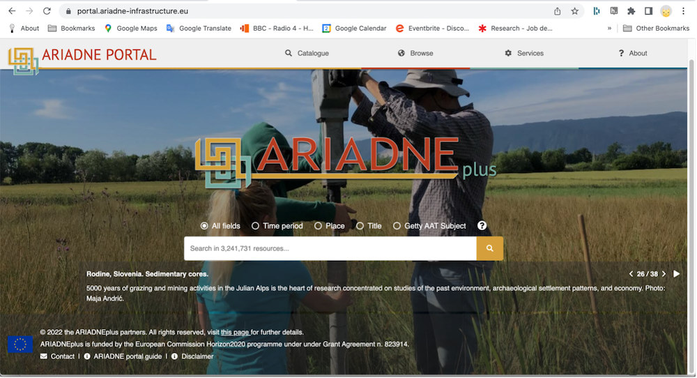
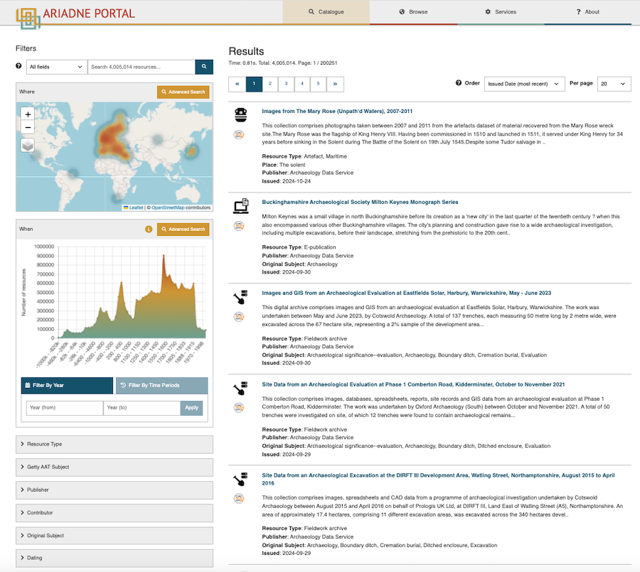
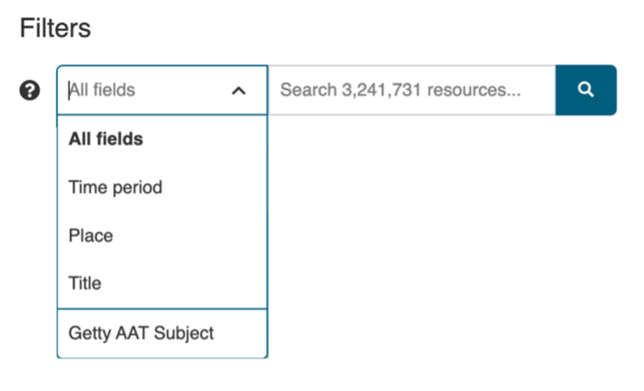

# Using the ARIADNE Catalogue

The ARIADNE Portal contains a Catalogue and several services which provide access to over 4 million archaeological resources that can be searched and filtered according to a number of criteria. The returned results from the search facilities provided with the Catalogue are listed individually as well as aggregated results on the map and on the timeline. This Guide aims at helping all end users to get the maximum benefit from using the Catalogue.

A separate section of the Portal provides several services and tools to assist archaeologists with their research, from planning data management, exploration and analysis to display of all types of data (including from the ARIADNE Knowledgebase, where applicable). Each of these services has its own information on their use and application, so are not covered by this Guide.

For further information about the ARIADNE Research Infrastructure and the Portal, see the   [**? About page**](https://portal.ariadne-infrastructure.eu/about).

## Searching the Catalogue
Entry to the catalogue consists of a text entry search box with the option to apply one of four filters.

{ width="850" }

<i>Catalogue entry page</i>

The search is designed to start with one or more key words where logical “AND” is applied. For example, a search for “gold coin” will return only records where both these words are to be found in the metadata record. The default setting is “All fields”, i.e. the whole record is searched for matching terms. Omitting a key word defaults to the entire Catalogue, the returned results depending on the filters selected.

There are four filters available for a more targeted search:

- **Time period** – name of time period(s) e.g. Iron age, medieval…
- **Place** – place name which can be anything from a specific location to a continent.
- **Title** – only the title fields are searched for matching terms.
- **Getty AAT Subject** – the subject(s) defined by the data provider are matched to the Getty Arts and Architecture Thesaurus which enables the end user to see and search for data with matching translations and also related terms.

For the Time Period, Place and Title filters, only exact matches in the language used are returned. E.g. if Time Period is selected, the Swedish term for Bronze Age, “bronsålder”, will return all records with the text “bronsålder” in the Dating field.

The Getty AAT Subject option enables a multi-lingual search to be performed by returning all records that contain a native language match (in the Original subject field) to the English Getty AAT subject as well as that specified in the Getty AAT Subjects field when this is present. Furthermore, since the search is hierarchical, any broad term such as “weapons” will also include all sub-categories such as swords, axes, daggers, etc. The search will return records that contain these subjects as well as those with matching terms in other languages.

[**More about the Getty ATT**](https://www.getty.edu/research/tools/vocabularies/aat/about.html)

## The Search results page
The search results are displayed with a wider range of filters which can be used to further refine the results.

{ width="850" }

<i>Search results page</i>

The search results can refined using a combination of What, Where and When as well as the individual filters. The following sections explain how each of these filters can be used to narrow down the search results.

| What | Description |
| ------------- | ----------- |
|  | The search text entry box is immediately below 'Filters' in the top left hand corner of the page.    The first set of filters located in the drop-down menu are a repeat of the filters found on the Catalogue entry page (as described above). |

