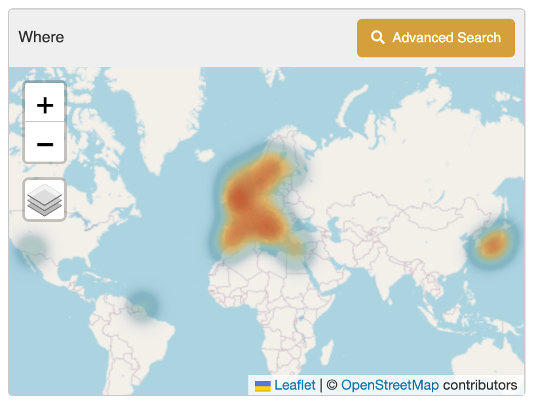
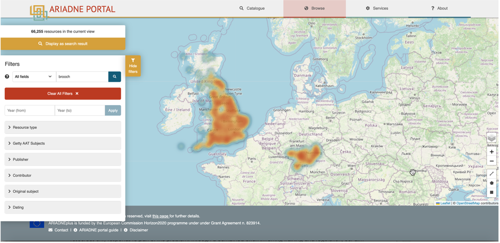
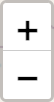
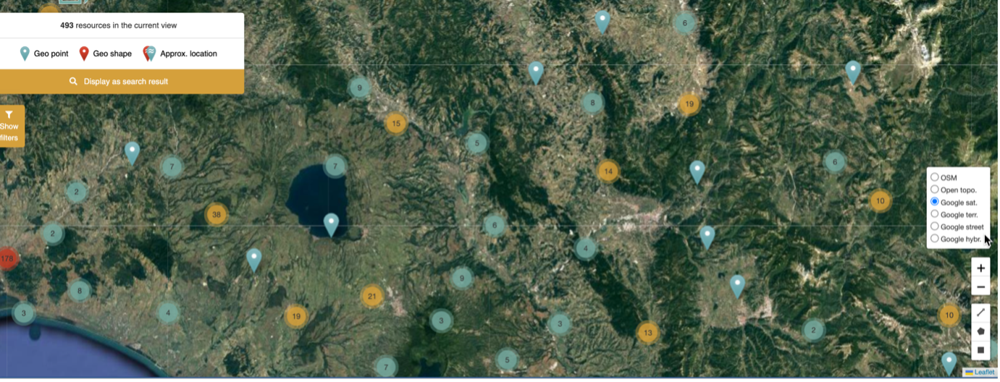
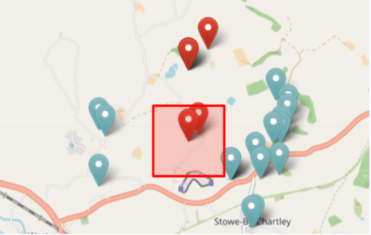
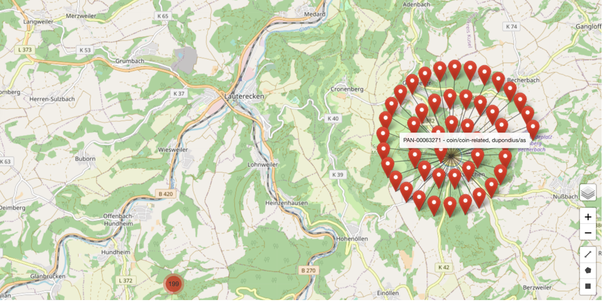

# The Map (Where)

| Where | Description |
| ----------- | ----------- |
|  | The map on the Search results page displays the location of the records returned in the search results (where co-ordinates have been provided). These are shown as ‘heat spots’ at this macro level, covering Europe and Japan in the example to the left.   It is possible to zoom in and out (to a limited level) and to change the layers as indicated by the icons. See below for more information about these options.  Clicking on ‘Advanced Search’ will open the Map filter page where the search results can be refined geographically by selecting an area on the map. |

## Advanced search

<i>Map filter page with full set of filters (left) geographical tools (right)</i>

The map can be used inter-changeably with the other filters which are displayed on the left side of the screen. They can be hidden by clicking on the yellow tab to the right of this column (Hide filters). 

The default view is a geographic Open Street Map (OSM) showing national borders. Note that native language place names are used on this map. 

There are a number of options for use with the map filter, the icons for which are shown in a column in the bottom right hand corner. 

| Icon | Description |
| ----------- | ----------- |
|  | The Layers icon displays a sub-menu with six different options for the display of the map, four of which are from Google including a satellite and a street map version (granularity will depend on level of survey) and where English is used for all place names. |
|  | The Zoom (in and out) icons for panning in and out of geographic regions. This can also be achieved with a touchpad (and mouse where enabled).|
|  | The Drawing tools icons:  The Line tool will display the distance covered as each point is drawn. 
The Polygon tool defines a multi-sided area on the map.   The Rectangle tool defines a rectangular area between two opposite corners. 
The results are updated to show only the records located within the defined areas |

Once an area of interest has been defined, all the related resources can be displayed on the Results page by clicking on the ‘Display as search result’ part of the information box displayed in the top left corner of the screen

<i>Map shown in Google Satellite mode showing both individual and clusters of resources</i>

## Representation of resources on the map

<i>Pin icons used to represent resources on the Map</i>
  
Different modes are used to represent how resources are shown on the map. 
- A Geo point shows a single resource with exact co-ordinates. If there are more than one Geo point on the Map, then the one for the current resource is denoted by an inner red ring. 
- A Geo shape indicates a resource where the location is not precise. This may be due to the location being given as a geographical area (e.g. a town or region) for a resource or, for example, reports which cover large and/or multiple locations.
- Approx. location icons are shown where the location of the resource is considered to be sensitive, for example, ship wrecks or sites where valuable metal artefacts have been found. Blue ‘pins’ indicate an approximate point and red ‘pins’ an area. The individual record for red ‘pin’ sites will display a defined (often rectangular) area for the resource where the actual location will be a random point within the shown area.

| Icons | Description |
| ----------- | ----------- |
|  | In this example, the red outline defines the area in which a gold finger ring was found and contains two other resources with nearby, imprecise locations. Other resources, both with exact and imprecise locations can also be seen within the larger area. |

Mouseover can be used on each individual Geo point and Geo shape to display the title of the associated Resource. In this example, the circular pattern of Geo shapes refers to a cluster of resources which have all been allocated the same approximate location (i.e. the centroid point) and which can be clicked on to go to the related resource record. 

Note that the Map functions in the same way in the Browse options as for the Results page, i.e. the same icons are used. There are some minor differences for the Map on the individual Resource page which are mainly to do with the display of an imprecise or approximate location for a resource. 
