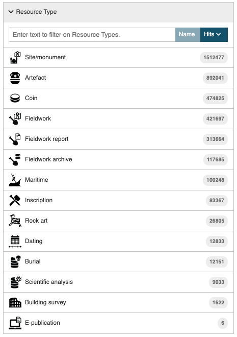
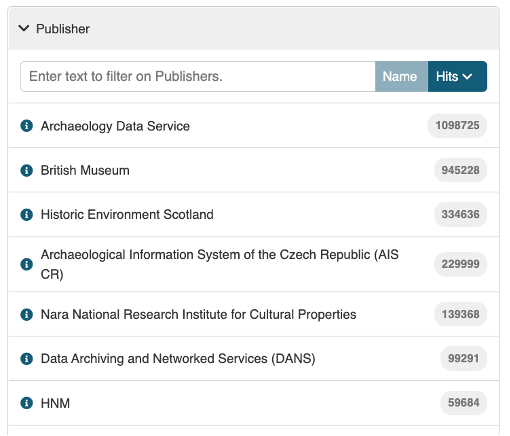
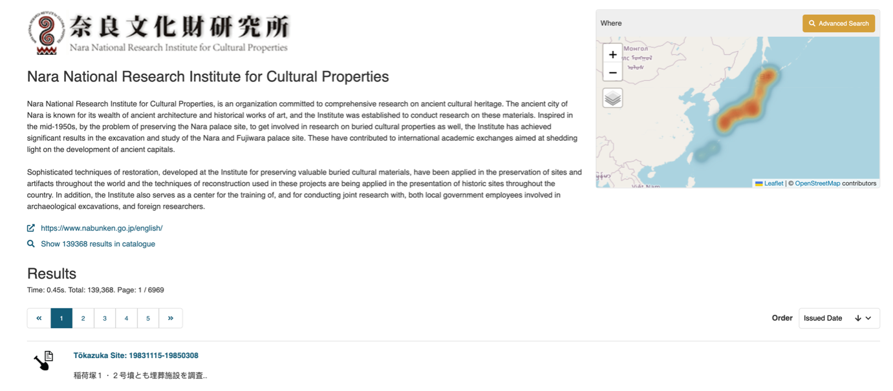
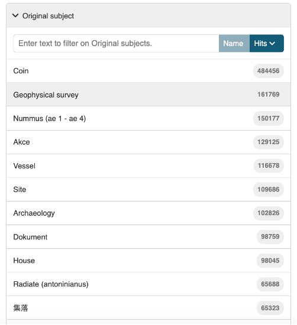
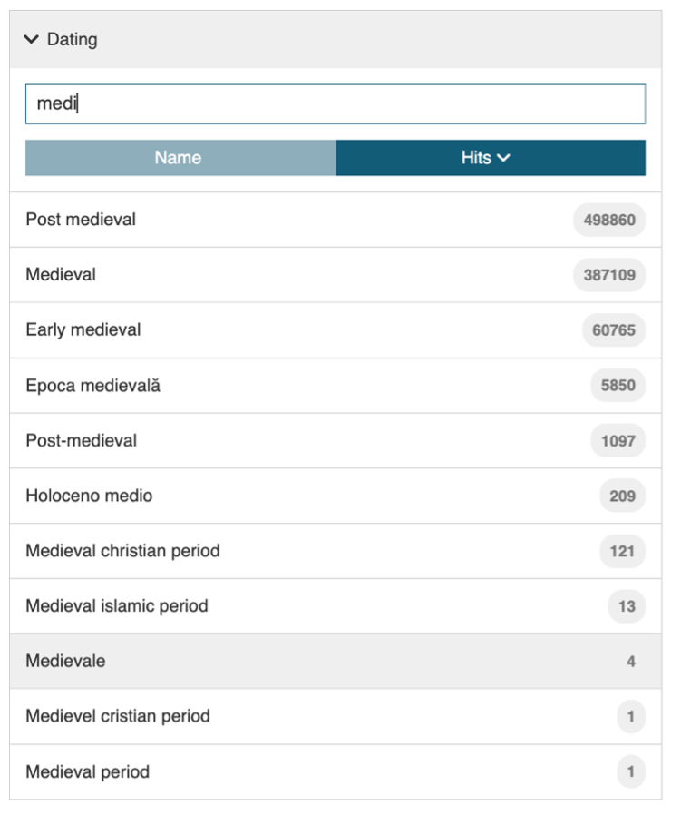

{ width="850" }

# Search Filters

In addition to the What, Where and When tools, there are a number of filters that each operate on a specific field in the metadata that can be used to refine the returned search results.

## Text entry
The text entry looks for matching terms in key metadata fields so the returned results may be quite large in number and varied in subject matter, requiring further refinement.

| What | Description |
| ------------- | ----------- |
| &nbsp;&nbsp;&nbsp;&nbsp;&nbsp;&nbsp;&nbsp;&nbsp;&nbsp;&nbsp;&nbsp;&nbsp;&nbsp;&nbsp;&nbsp;&nbsp;&nbsp;&nbsp;&nbsp;&nbsp;&nbsp;&nbsp;&nbsp;&nbsp;&nbsp;&nbsp;&nbsp;&nbsp;&nbsp;&nbsp;&nbsp;&nbsp;&nbsp;&nbsp;&nbsp;&nbsp;&nbsp;&nbsp;&nbsp;&nbsp;&nbsp;&nbsp;&nbsp;&nbsp;&nbsp;&nbsp;&nbsp;&nbsp;&nbsp;&nbsp;&nbsp;&nbsp;&nbsp;&nbsp;&nbsp;&nbsp;&nbsp;&nbsp;&nbsp;&nbsp;&nbsp;&nbsp;&nbsp;&nbsp;&nbsp;&nbsp;&nbsp;&nbsp;&nbsp;&nbsp;&nbsp;&nbsp;&nbsp;&nbsp;&nbsp;  | The search text entry box is immediately below 'Filters' in the top left hand corner of the page.    The first set of filters located in the drop-down menu are a repeat of the filters found on the Catalogue entry page. |

## Resource Type

The Resource type is an ARIADNE concept designed to categorise the resources into general areas of interest to archaeologists and the names are mostly self-explanatory. 

| Resource Type | Description |
| ----------- | ----------- |
| &nbsp;&nbsp;&nbsp;&nbsp;&nbsp;&nbsp;&nbsp;&nbsp;&nbsp;&nbsp;&nbsp;&nbsp;&nbsp;&nbsp;&nbsp;&nbsp;&nbsp;&nbsp;&nbsp;&nbsp;&nbsp;&nbsp;&nbsp;&nbsp;&nbsp;&nbsp;&nbsp;&nbsp;&nbsp;&nbsp;&nbsp;&nbsp;&nbsp;&nbsp;&nbsp;&nbsp;&nbsp;&nbsp;&nbsp;&nbsp;&nbsp;&nbsp;&nbsp;&nbsp;&nbsp;&nbsp;&nbsp;&nbsp;&nbsp;&nbsp;&nbsp;&nbsp;&nbsp;&nbsp;&nbsp;&nbsp;&nbsp;&nbsp;&nbsp;&nbsp;&nbsp;&nbsp;&nbsp;&nbsp;&nbsp;&nbsp;&nbsp;&nbsp;&nbsp;&nbsp;&nbsp;&nbsp;&nbsp;&nbsp;&nbsp;&nbsp;&nbsp;&nbsp;&nbsp;&nbsp;&nbsp;&nbsp;&nbsp;&nbsp;&nbsp;&nbsp;&nbsp;&nbsp;&nbsp;&nbsp;&nbsp;&nbsp;&nbsp;&nbsp;&nbsp;&nbsp;&nbsp;&nbsp;&nbsp;&nbsp;&nbsp;&nbsp;&nbsp;&nbsp;&nbsp;&nbsp;&nbsp;&nbsp;&nbsp;&nbsp;&nbsp;&nbsp;&nbsp;&nbsp;&nbsp;&nbsp;&nbsp;&nbsp;&nbsp;&nbsp;&nbsp;&nbsp;  | Those Resource types that may need clarification are:   **Fieldwork** – normally a record relating to specific fieldwork e.g. evaluations, interventions, etc.   **Fieldwork report** – these always have a link (URL or DOI) to the actual document.  **Fieldwork archive** – the record refers to a collection of documents, images etc. relating to a site (accessible from the DOI supplied).  **Dating** – datasets using for dating materials e.g. radio carbon and dendrology. |

More than one Resource type can be selected but note that the default operator on terms within a filter is ‘AND’ so this will only result in records being found where all the selected terms have been used. For example, all “Maritime” resources are also classified as Resource type “Site/monument” so combining both Resource types has the same result as selecting just ”Maritime” (this is logical as currently the maritime records relate to ship wrecks). Conversely, Resource type  “Artefacts” and “Coins” have been applied separately and the only record that is returned matching both Resource types is the Collection record for the Portable Antiquities Scheme. In most cases, this filter is useful for excluding records that do not match the specified Resource type.

## Getty AAT Subjects

The Getty Arts and Architecture Thesaurus (AAT) has been used to classify each resource, mapping the original subject(s) to those found in this extensive ontology. Over one thousand terms have been used and each resource usually has more than one term assigned to it. 

The use of this filter is highly recommended to obtain accurate, meaningful results. 

<i>The Getty Arts & Architecture Thesaurus Subjects filter</i>

The Getty AAT is hierarchical in structure and when a (single) higher level term is specified in this filter, the search results will also include all the sub-categories. So, the general term “weapons” will also include resources with terms such as “knives”, “spears” and “daggers” as these are sub-categories of “weapons”.

When multiple terms are used as a filter, logical ‘AND’ is applied so only resources matching all the terms will be returned in the search results. Hierarchical sub-categories are not used with multiple terms, only the term specified. Hence, if a search was made for “Weapons”  and “Warships”, there are no results but if “Cannons (artillery)” is used instead of "Weapons", then there are results as both the exact terms have been used for the matching resources. 

When a set of search results is displayed, the Getty AAT filter will only show the first 20 terms found within the current set of resources, starting with the most numerous matches ordered by size. More terms can be displayed by clicking on the “Get 20 more results..” box at the end of the displayed list which extends the list with a scroll bar. This can be repeated until all the matching terms may be viewed. 

## Publisher

| Publisher | Description |
| ----------- | ----------- |
| &nbsp;&nbsp;&nbsp;&nbsp;&nbsp;&nbsp;&nbsp;&nbsp;&nbsp;&nbsp;&nbsp;&nbsp;&nbsp;&nbsp;&nbsp;&nbsp;&nbsp;&nbsp;&nbsp;&nbsp;&nbsp;&nbsp;&nbsp;&nbsp;&nbsp;&nbsp;&nbsp;&nbsp;&nbsp;&nbsp;&nbsp;&nbsp;&nbsp;&nbsp;&nbsp;&nbsp;&nbsp;&nbsp;&nbsp;&nbsp;&nbsp;&nbsp;&nbsp;&nbsp;&nbsp;&nbsp;&nbsp;&nbsp;&nbsp;&nbsp;&nbsp;&nbsp;&nbsp;&nbsp;&nbsp;&nbsp;&nbsp;&nbsp;&nbsp;&nbsp;&nbsp;&nbsp;&nbsp;&nbsp;&nbsp;&nbsp;&nbsp;&nbsp;&nbsp;&nbsp;&nbsp;&nbsp;&nbsp;&nbsp;&nbsp;&nbsp;&nbsp;&nbsp; | The Publisher is the organisation which has supplied the metadata to the Catalogue and is responsible for the maintenance and updating of this metadata.   The Publisher may also own the original data or be responsible for its maintenance as in the case of regional and national repositories. |

Note that the “i” icon next to each name provides a short summary about the Publisher in a new page which also shows the geographic distribution of their records on the map and the first 20 of these below a link to the Publisher’s website. The second link will display the results in the standard ‘Results’ page.

{ width="850" }

<i>The Publisher information for Nara, Japan</i>

## Contributor

| Contributor | Description |
| ----------- | ----------- |
| &nbsp;&nbsp;&nbsp;&nbsp;&nbsp;&nbsp;&nbsp;&nbsp;&nbsp;&nbsp;&nbsp;&nbsp;&nbsp;&nbsp;&nbsp;&nbsp;&nbsp;&nbsp;&nbsp;&nbsp;&nbsp;&nbsp;&nbsp;&nbsp;&nbsp;&nbsp;&nbsp;&nbsp;&nbsp;&nbsp;&nbsp;&nbsp;&nbsp;&nbsp;&nbsp;&nbsp;&nbsp;&nbsp;&nbsp;&nbsp;&nbsp;&nbsp;&nbsp;&nbsp;&nbsp;&nbsp;&nbsp;&nbsp;&nbsp;&nbsp;&nbsp;&nbsp;&nbsp;&nbsp;&nbsp;&nbsp;&nbsp;&nbsp;&nbsp;&nbsp;&nbsp;&nbsp;&nbsp;&nbsp;&nbsp;&nbsp;&nbsp;&nbsp;&nbsp;&nbsp;&nbsp;&nbsp;&nbsp;&nbsp;&nbsp;&nbsp;&nbsp;&nbsp;&nbsp;&nbsp;&nbsp; | The Contributor is usually (but not always) the original owner of the data.  The Publisher creates and maps the metadata in the Catalogue on behalf of the Contributor.

## Original Subject

| Original Subject| Description |
| ----------- | ----------- |
| &nbsp;&nbsp;&nbsp;&nbsp;&nbsp;&nbsp;&nbsp;&nbsp;&nbsp;&nbsp;&nbsp;&nbsp;&nbsp;&nbsp;&nbsp;&nbsp;&nbsp;&nbsp;&nbsp;&nbsp;&nbsp;&nbsp;&nbsp;&nbsp;&nbsp;&nbsp;&nbsp;&nbsp;&nbsp;&nbsp;&nbsp;&nbsp;&nbsp;&nbsp;&nbsp;&nbsp;&nbsp;&nbsp;&nbsp;&nbsp;&nbsp;&nbsp;&nbsp;&nbsp;&nbsp;&nbsp;&nbsp;&nbsp;&nbsp;&nbsp;&nbsp;&nbsp;&nbsp;&nbsp;&nbsp;&nbsp;&nbsp;&nbsp;&nbsp;&nbsp;&nbsp;&nbsp;&nbsp;&nbsp;&nbsp;&nbsp;&nbsp;&nbsp;&nbsp;&nbsp;&nbsp;&nbsp;&nbsp;&nbsp;&nbsp;&nbsp;&nbsp;&nbsp;&nbsp;&nbsp;&nbsp;&nbsp;&nbsp;&nbsp;&nbsp;&nbsp;&nbsp;&nbsp;&nbsp;&nbsp;&nbsp;&nbsp;&nbsp;&nbsp;&nbsp;&nbsp;&nbsp;| The original subject is the term from the ontology used by the Contributor and/or Publisher and which is then mapped to the Getty AAT.  The Original subject will, in most cases, be in the native language of the provider. The option to filter using alternative, localised terms facilitates both multi-lingual searches (i.e. in languages other than English) and terminology specific to a Publisher (country). |

## Dating

The dating filter can be viewed as a ‘catch all’ filter which works solely on the information in the ‘Dating’ field of the metadata. This is a broad category which includes named periods as well as date numerals, general terms such as ‘16th century’ and localised terms specific to regions. Rather than lose this information and make resources less findable, the Dating filter is intended to cover all the resources, some of which may not have both start and end dates or PeriodO definitions. 

| Dating | Description |
| ----------- | ----------- |
| &nbsp;&nbsp;&nbsp;&nbsp;&nbsp;&nbsp;&nbsp;&nbsp;&nbsp;&nbsp;&nbsp;&nbsp;&nbsp;&nbsp;&nbsp;&nbsp;&nbsp;&nbsp;&nbsp;&nbsp;&nbsp;&nbsp;&nbsp;&nbsp;&nbsp;&nbsp;&nbsp;&nbsp;&nbsp;&nbsp;&nbsp;&nbsp;&nbsp;&nbsp;&nbsp;&nbsp;&nbsp;&nbsp;&nbsp;&nbsp;&nbsp;&nbsp;&nbsp;&nbsp;&nbsp;&nbsp;&nbsp;&nbsp;&nbsp;&nbsp;&nbsp;&nbsp;&nbsp;&nbsp;&nbsp;&nbsp;&nbsp;&nbsp;&nbsp;&nbsp;&nbsp;&nbsp;&nbsp;&nbsp;&nbsp;&nbsp;&nbsp;&nbsp;&nbsp;&nbsp;&nbsp;&nbsp;&nbsp;&nbsp;&nbsp;&nbsp;&nbsp;&nbsp;&nbsp;&nbsp;&nbsp;&nbsp;&nbsp;&nbsp;&nbsp;&nbsp;&nbsp;&nbsp;&nbsp;&nbsp;&nbsp;&nbsp;&nbsp;&nbsp;&nbsp; | In the example here, all matches to the first four characters “medi” entered in the text box are listed. As can be seen, there are several matches to the (intended) term of “medieval” and also a few others where different spellings or languages have been used in the original metadata. One term, Holoceno medio (Mid-Holocene) is an unintended match! |
