{ width="850" }

# The Resource page
Clicking on the title of a resource from the Search results page will display the metadata record and all associated information for that resource on a new web page. At the top of the page, the resource’s location is shown on a map where zoom in and out can be done using the ‘+’and ‘-‘ icons on the right hand side. The is also the option to change the layers. Below these icons there is a further rectangular icon which is a pop-up menu with options for changing the size of the dislayed map, these being small (default), medium and full screen. 

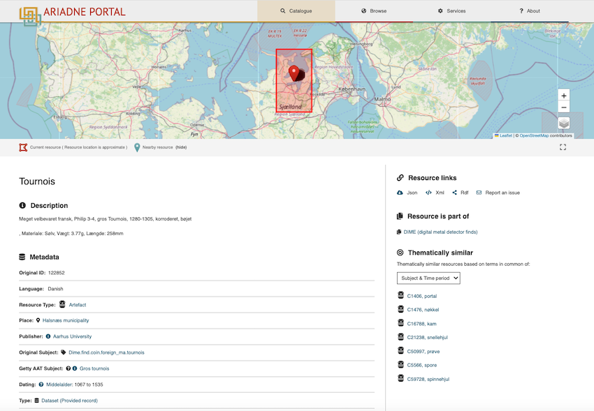{ width="850" }

<I>Top part of the Resource page</I>

[This example](https://portal.ariadne-infrastructure.eu/resource/24d2b18c2f6c0ebe0d3ad5eb5238028efa63d8f03cdd9a7a8c210cd94ae1c1be) is from the DIME database and since it is a find, the location is shown as an approximate area where this particular coin was found. The Geo shape indicates that there is at least one other find nearby and clicking on it will display the relevant record. Multiple finds are displayed in sequence (i.e. click through one at a time) to avoid displaying multiple bounding boxes. The rest of the Resource page is shown below - this collection also has images of the finds so the resource data includes thumbnails pictures.

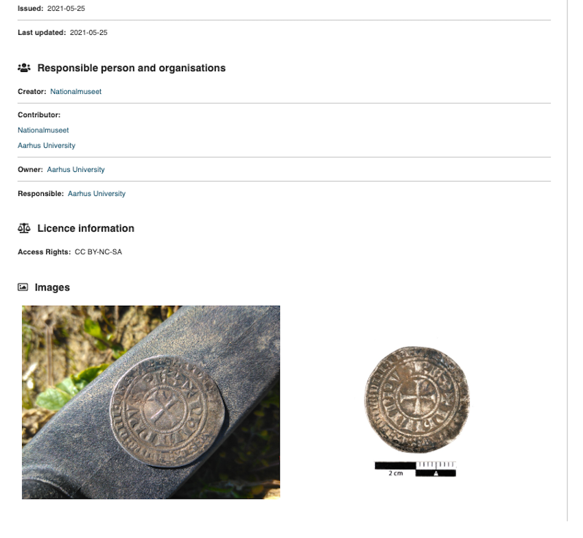{ width="850" }

<I>Remaining part of the Resource page</I>

The map can be enlarged by clicking on the frame icon below the Zoom icons to display the Map size menu as shown here. The size of the map on the resource page  can be increased (and reduced) using the Medium and Full Screen options, the default setting being Small.

## Display of near-by resources on the map

For each record for an individual resource, the map may also display Geo points or shapes for other resources located close by which are included in the returned search results. In [the example below](https://portal.ariadne-infrastructure.eu/resource/7c2db68bc992937c2c71040f9da411c0a6f75bb56d139b1570bdce84412502e4), the search term ‘Sword’ was used and this record (published by the National Monuments Service, Republic of Ireland) includes this word in the description of the Chest tomb panel that this record refers to (denoted by Geo shape with the red circle inset). Note that this resource would not be included in the search results if the Getty AAT filter was used with the term "Sword" as this has been classified as a "Tomb". There are several other sites and monuments of interest in this area, each denoted by a separate Geo shape. Clicking on any of the Geo shapes will display the associated resource.

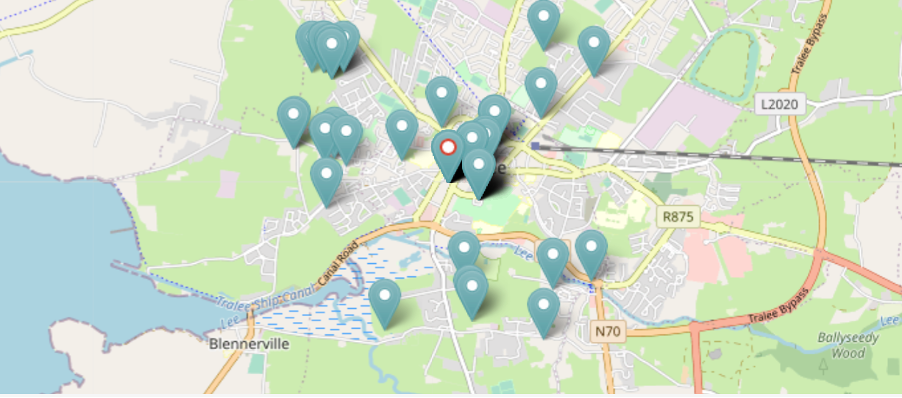

<i>Chest Tomb, Tralee, County Kerry, Ireland and other nearby resources</i>

The display of nearby resources can result in an approximate location shape for the current resource containing one or more icons (as well as close by) which refer to different nearby resources. In the following example, the resource map shown is for a Gold Quarter stater (resulting from a search for gold coins). There is no Geo shape for the coin as an approximate location is used as indicated by the red bounding box.  However, seven other nearby resources are shown as separate Geo shapes and each record can be displayed by clicking on the Geo shape associated with it.

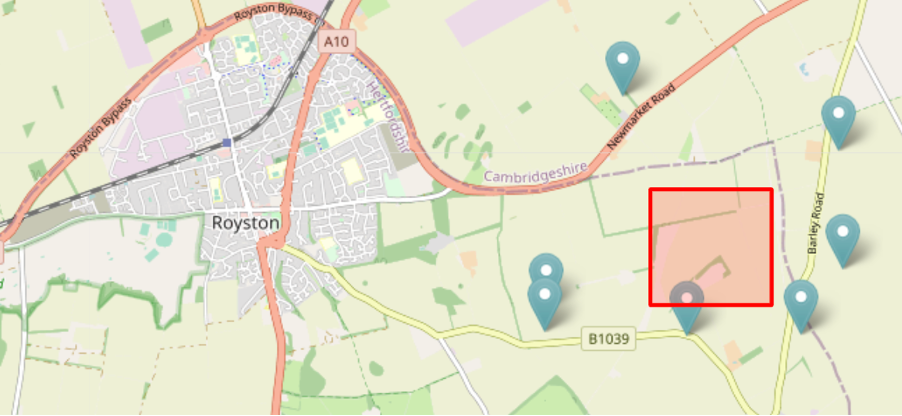

<I>Approximate location of Gold Quarter stater shown by red bounding box along with nearby resources</I>

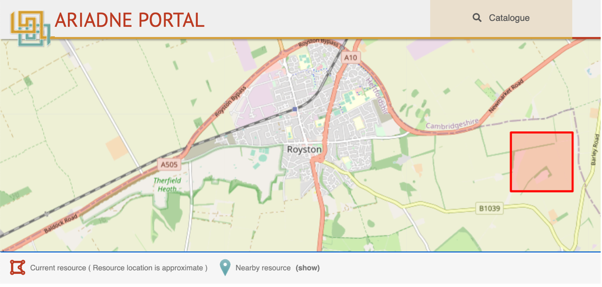

<I>Approximate location of Gold Quarter stater shown by red bounding box with nearby resources now hidden</I>

Nearby resources can be hidden and shown by clicking on the toggle Geo shape icon “Nearby resources”  on the left below the map. In the above example, only the approximate location of the resource is now shown after hiding the nearby resources. Note that where the location of a nearby resource is also defined by an approximate location, this is shown as a Geo point as displaying overlapping shapes would get messy. If there is more than one resource with an overlapping bounding box, only the next resource in the sequence is shown. Each (overlapping) resource may be displayed in turn by clicking through the sequence. 

##  The metadata

The Title of this resource (Mønt) is shown followed by the Description (in Danish) and several self-explanatory Metadata fields.

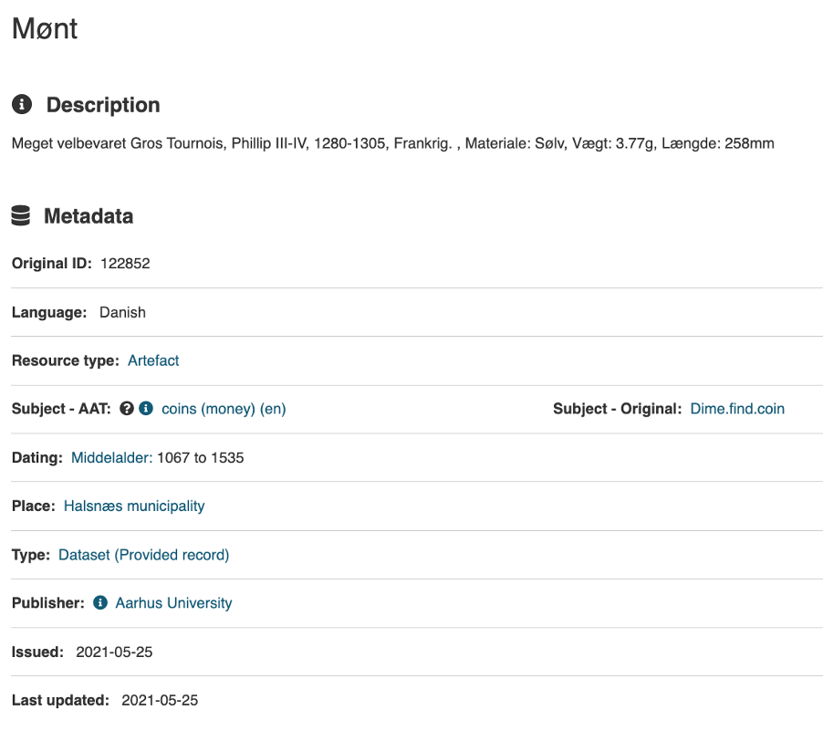

<I>Resource metadata for resource Mønt</I>

Note that the Google translation for the Description is: Very well preserved Gros Tournois, Phillip III-IV, 1280-1305, France. , Material: Silver, Weight: 3.77g, Length: 258mm

In addition, the Resource type is ‘Artefact’ rather than ‘Coin’ as all DIME database resources are classified using this broader term. The Getty AAT subject is used to provide a more accurate description.

### Responsible person and organisations, Licence information

| Metadata | Description |
| ----------- | ----------- |
|&nbsp;&nbsp;&nbsp;&nbsp;&nbsp;&nbsp;&nbsp;&nbsp;&nbsp;&nbsp;&nbsp;&nbsp;&nbsp;&nbsp;&nbsp;&nbsp;&nbsp;&nbsp;&nbsp;&nbsp;&nbsp;&nbsp;&nbsp;&nbsp;&nbsp;&nbsp;&nbsp;&nbsp;&nbsp;&nbsp;&nbsp;&nbsp;&nbsp;&nbsp;&nbsp;&nbsp;&nbsp;&nbsp;&nbsp;&nbsp;&nbsp;&nbsp;&nbsp;&nbsp;&nbsp;&nbsp;&nbsp;&nbsp; 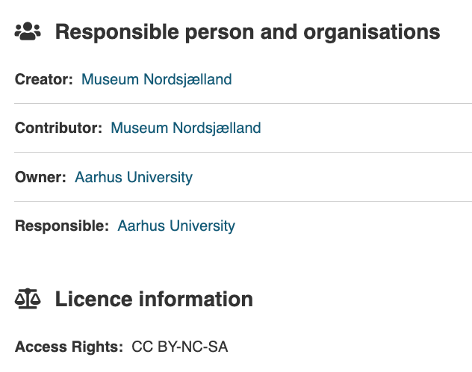 | The **Creator** is the original author of the resource information.   The **Contributor** is the organisation (or person) who has supplied the metadata about the resource.    The **Owner** is the organisation (or person) who owns the licence.    The **Responsible** is the organisation (or person) legally responsible for the maintenance of the resource data.    The **Licence** is Creative Commons and indicates the permitted access and reuse of the metadata.|
 
### Images

| Metadata | Description |
| ----------- | ----------- |
| 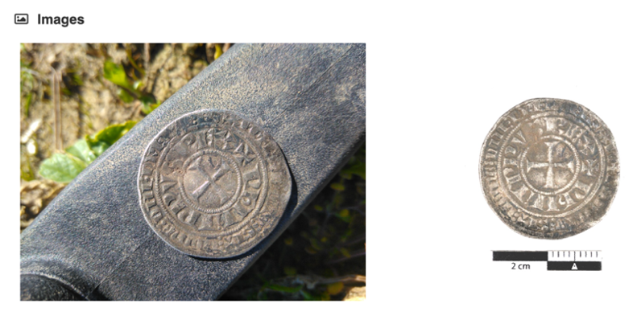 | Some of the resources in the Catalogue also have images which are shown at the bottom of the Resource page.    The first image is also shown as a thumbnail with the summary information for that record on the Results page.|

### Resource links

| Option | Description |
| ----------- | ----------- |
|&nbsp;&nbsp;&nbsp;&nbsp;&nbsp;&nbsp;&nbsp;&nbsp;&nbsp;&nbsp;&nbsp;&nbsp;&nbsp;&nbsp;&nbsp;&nbsp;&nbsp;&nbsp;&nbsp;&nbsp;&nbsp;&nbsp;&nbsp;&nbsp;&nbsp;&nbsp;&nbsp;&nbsp;&nbsp;&nbsp;&nbsp;&nbsp;&nbsp;&nbsp;&nbsp;&nbsp;&nbsp;&nbsp;&nbsp;&nbsp;&nbsp;&nbsp;&nbsp;&nbsp;&nbsp;&nbsp;&nbsp;&nbsp;&nbsp;&nbsp;&nbsp;&nbsp;&nbsp;&nbsp;&nbsp;&nbsp;&nbsp;&nbsp;&nbsp;&nbsp;&nbsp;&nbsp;&nbsp;&nbsp;&nbsp;&nbsp;&nbsp; 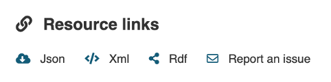 | **View resource at provider** is the Landing page URL. The other Resource links are for technical applications apart from Report an issue.|

**Json** – displays the resource data formatted in JSON. This is all the data (and combinations of data) available for that specific resource. (This data is very close to how the data is formatted and looks in the OpenSearch source).

**Xml** – displays the resource data formatted in XML (as for JSON).

**RDF** - generates a RDF file of the resource data for downloading.

**Cite** - 

**Report an issue** – this option generates a Contact form (shown below) containing the resource id (Subject) in which end users can report any issues they encounter with the Catalogue.

 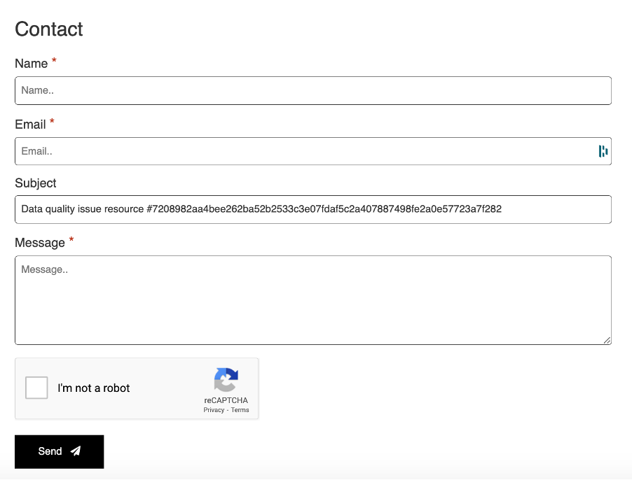|

<I>The Contact form</I>

### Resource is a part of

| Metadata | Description |
| ----------- | ----------- |
| &nbsp;&nbsp;&nbsp;&nbsp;&nbsp;&nbsp;&nbsp;&nbsp;&nbsp;&nbsp;&nbsp;&nbsp;&nbsp;&nbsp;&nbsp;&nbsp;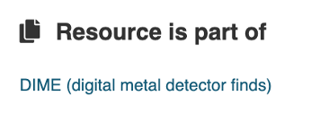 | This section indicates the Collection or dataset that the resource belongs to. It provides a link to a new page with further information and access to the other resources within the Collection. |

The Collection record for DIME is shown here:

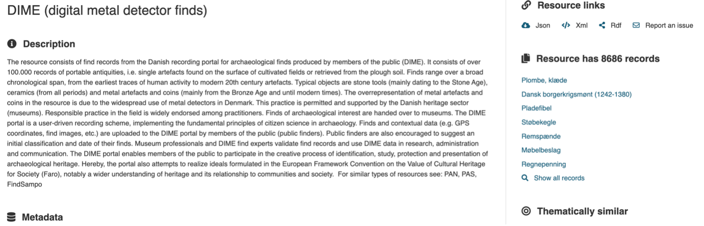

The remainder of the page follows the same format as the individual Resource page.

### Thematically similar

| Option | Description |
| ----------- | ----------- |
|&nbsp;&nbsp;&nbsp;&nbsp;&nbsp;&nbsp;&nbsp;&nbsp;&nbsp;&nbsp;&nbsp;&nbsp;&nbsp;&nbsp;&nbsp;&nbsp;&nbsp;&nbsp;&nbsp;&nbsp;&nbsp;&nbsp;&nbsp;&nbsp;&nbsp;&nbsp;&nbsp;&nbsp;&nbsp;&nbsp;&nbsp;&nbsp;&nbsp;&nbsp;&nbsp;&nbsp;&nbsp;&nbsp;&nbsp;&nbsp;&nbsp;&nbsp;&nbsp;&nbsp;&nbsp;&nbsp;&nbsp;&nbsp;&nbsp;&nbsp;&nbsp;&nbsp;&nbsp;&nbsp;&nbsp;&nbsp;&nbsp;&nbsp;&nbsp;&nbsp;&nbsp;&nbsp;&nbsp;&nbsp; |Thematically similar lists up to seven similar resources from the whole Catalogue. The default setting is ‘Subject & Time period”. In this case, records with similar (Original) subjects and in a similar time period will be searched for and the first seven listed.|

In addition to the default term of “Subject & Time period”, there are four other criteria that can be used to find similar resources:
- Title – title of resource (matches all or some words used in the title)
- Location – other resources found within 2km of the centroid of the original resource location.
- Subject – resources with the same Original subject classification?
- Time period – resources falling within the same time period (start and end dates).

## The Horizontal Menu options

There are four options in the horizontal menu across the top of the page:
- Catalogue – this returns the user to the initial Results page with the default search showing all the records. As all the filters are available on this page, this page is considered to be more useful than the landing page displayed upon initial entry to the Catalogue.
  
- Browse – this contains three options for searching the catalogue/knowledgebase based on Where, When and What.
 **Where** – displays the map filter. This is a stand-alone version which works in exactly the same way as described previously.
 **When** – displays the time line filter. This is a stand-alone version which works in exactly the same way as described previously.
 **What** – this displays an interactive Wordle representing the distribution of the Getty AAT subject terms in the current selection by the relative size of each term to each of the others. 
  Note that selecting a Browse option will automatically clear all previously set filters so, in the case of Where and When, these should be used from the Results page to refine the results.

- Services - links to the Portal Services page which contains a description and link for each one.

- About – a brief overview of the project.

### The Browse “Where” tool

This is the Map tool covered in section 2: [The Map tool (Where)](https://ariadne-infrastructure.github.io/docs/Portal_User_Guide/Section-2_Map_Where/)

### The Browse “When” tool

This is the Time Period tool covered in section 3: [The Time period tool (When)](https://ariadne-infrastructure.github.io/docs/Portal_User_Guide/Section-3_Time_period_When/)

### The Browse “What” tool

The “What” filter tool an interactive Wordle based upon the first twenty most common Getty AAT Subject(s) recorded for the current selection, the default on entry being the entire Catalogue. In the example shown, the term “weapons” has been used. The results show all the sub-classes of this term (since the Getty AAT Subject is hierarchical) such as axes, spears, arrowheads and knives as well as the other terms (most of which describe the context) which were recorded with the weapons. 

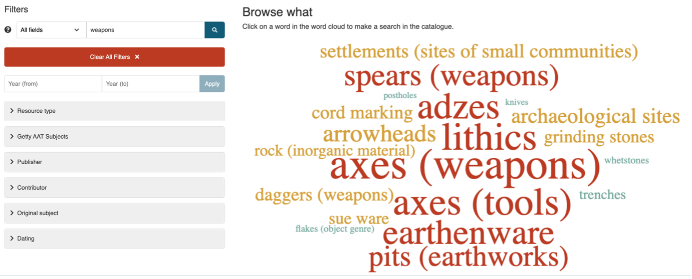 

To explore further, click on any of the terms to display the corresponding resources on the Results page. From here, filters can be applied as described previously.

