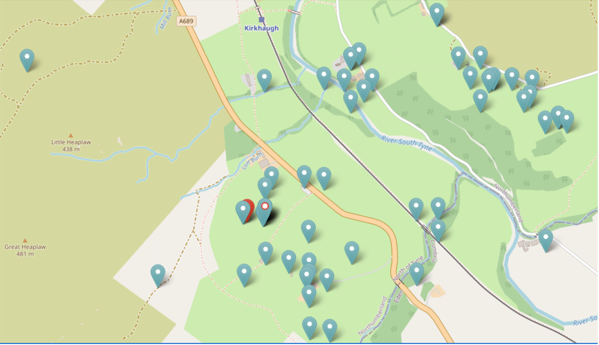
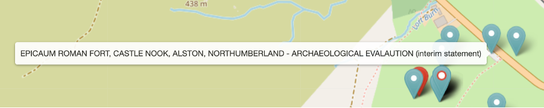
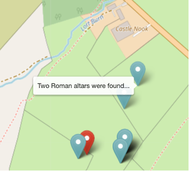
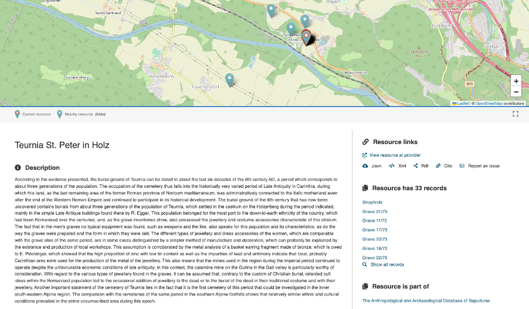
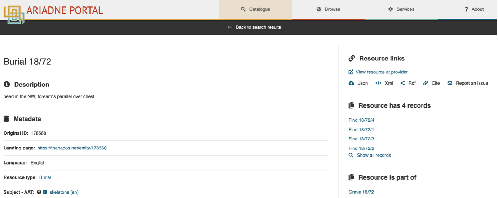
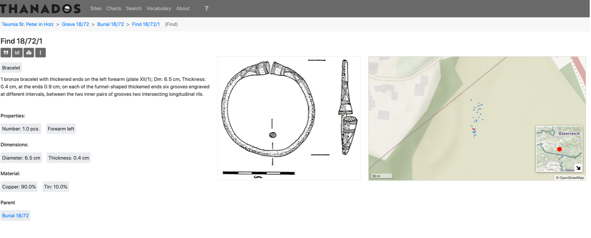

{ width="850" }

# Tips and guidance for searching the Catalogue
## How the metadata has been mapped
The metadata in the Catalogue has originated from many different sources with varying levels of information and data models. In the first instance, these have been mapped to the AO-CAT which caters for most archaeological domains. However, there are some specialist domains which require additional concepts and terminology to be successfully mapped (otherwise a lot of relevant information would be lost) and two approaches have been used to address this issue.
### Application profiles
The first solution used is the the Application Profile which is an extension of the (CIDOC CRM based) AO-CAT data model. These enable additional data fields to be added and mapped for the Catalogue. Examples of specialist Application Profiles developed during the ARIADNEplus project are for the domains of “heritage science” (which covers scientific datasets such as aDNA and radio carbon dating), “inscriptions, marks and graffiti” and “burials and mortuary data”.  
### Additional ontologies
An alternative approach, which is more appropriate when a domain can basically map to the AO-CAT but also has its own distinct terminology is to adopt an additional Ontology to extend the vocabulary used for metadata descriptions. In many cases, it is also possible to map the subject matter to the Getty AAT but as this was developed as a more general thesaurus, it doesn’t always contain the level of detail used in archaeology. To mitigate this, the original subject is also included in the search on all fields in the Catalogue and when the Getty AAT filter is used, the results are hierarchical i.e. they match the specified term(s) and all sub-terms. Consequently, it may be better to start with general terms and then narrow these down rather than starting with a very specific search term. 

## Strategies for working with varying source metadata
The other major consideration is the supplied metadata which may vary from publisher to publisher depending on how their original source data is structured, the meaning attributed to the terminology used, how much metadata is available for mapping to the AO-CAT data model (and the extent to which the metadata can be cleaned and enhanced), etc. To give some examples of how this can affect the data in the Catalogue (and ways of mitigating the differences):

1.	A text search will result in the most resources since a match may be found in one of several metadata fields. These may not all be relevant since a description can include the search term as a feature found on an object or on a site. Filters such as the Resource type and Getty AAT Subjects should be used for more targeted searches.

2. The British Museum has supplied over 900,000 resources from the Portable Antiquities Scheme Database of which around half relate to coins and the other half to other types of artefacts which commonly make up ‘finds’. The coins all have Resource type “Coin” and the artefacts “Artefacts”. On the other hand, the DIME database (published by Aarhus University), which also records finds by the public in Denmark, has allocated Resource type “Artefacts” to all its resources, including coins. This is not wrong, it’s just another way of representing the data. To select all the resources from DIME that are coins, it is necessary to use “coins” as an initial search term and then filter by Publisher, Aarhus University, as the original subject (usually dime.find.coin) will indicate the type of artefact. The Getty AAT Subject has also been used, some granularity has been applied so five terms are listed of which the most common is “Later western world coins” (a sub-term of Coins (money)). 

3. Be aware that not all the resources (approx. 8%) have geographical co-ordinates supplied in their metadata and, where the location of the resource is considered sensitive, a bounding box will be shown containing a random ‘pin’ to indicate the approximate area. If there is a nearby resource, one pin will be shown – this can be clicked on to show the corresponding record. Where there are more than one resources nearby, these are shown in series, i.e. one at a time with each successive resource in the same location. This also means that in most cases, when the map filter is applied, the number of resources found will automatically reduce as all those missing location co-ordinates will be excluded from the results. 

4. Although it is possible to search the Catalogue using the (modern-day) Country filter, this can be fairly meaningless in the context of archaeology (even more so for marine archaeology!). Recorded place names are included in the metadata. More usefully, the Map allows the selection of areas of interest, including defining an area by drawing a polygon thus enabling borders to be ignored or otherwise. However, it can be useful to define a country, particularly islands or where national boundaries have remained fairly unchanged. One way to do this is through the Publisher filter as many of these providers are the national repository for their archaeological outputs. In many cases, Publishers have provided a Collection record which summarises provided datasets. Alternatively, the When filter can also include regions (within the PeriodO definitions) which may be used for defining areas of interest. 

## Working with time periods
Two approaches have been used to denote time periods – absolute start and end dates and period names. There are some obvious issues with both methods:
- If absolute dates are used across more than one country, it is likely that resources will be found that are not of interest as the dates can overlap from other periods or they may be approximate.
- PeriodO terms are used to describe archaeological time periods; it is well known that a defined period (e.g. “Bronze age”) in one country may cover a different time span in another country. However, the filter has been designed so that one or more defined periods may be used with the further option of restricting the named period(s) to a specific region(s). 

## Some examples of using the Catalogue to answer research questions

### Video: doing a search
[Video demonstration of a search](https://vimeo.com/1049348294). This 4 minute video</a> shows how to find all the records relating to submarines sunk around the British Isles during the Second World War using a selection of the available tools and filters.
### How to find all resources relating to a specific site or monument

This example illustrates the usefulness of the map and georeferencing resources, showing how:
- artefacts can be linked to archaeological sites,
- geo-refencing helps overcome the use of different names for sites and also the many different ways resource locations can be recorded (from individual site to church parish name),
- alternative and misspellings.

Epiacum is a Roman Fort located near the town of Alston, Cumbria on the border with Northumbria. It is unusual, being lozenge shaped and with impressive earthworks of banks and ditches and is relatively unexcavated. The fort is also known as Whitley Castle, this name being derived from the nearby Manor of Whitlaw. 

Starting with a search for “Epiacum”, five resources are found. These are all Historic England records which refer to fieldwork on the ramparts dated 1957,  two excavations dated 1810 and 1828, and one which links to a Historic England Research Record entitled “Whitley Castle Roman Fort” with useful references. Three of the resources are usefully entitled Whitley Castle (Epiacum?) indicating the alternative name. 

Using “Whitley Castle” as a search term finds 22 results, including those mentioned previously. These include several additional Historic England records, one referencing the 2007-08 survey,  another a report on a geomagnetic survey carried out by Durham University in 2009 and an archaeological investigation by English Heritage as well as a paleoenvironmental investigation from 2010. 

 Each of the results are displayed on the map with quite a few nearby resources shown:

<I>Search results for "Whitley Castle"</I>

Using mouse-over to reveal the titles of these neighbouring resources reveals some new ones:

<I>Highlighting a nearby resource using mouseover</I>

This Archaeological Evaluation (2018) resource could have been missed as the name in the title is misspelt and the location referred to is the name of the farm on whose land the Roman fort is located.

Included in the 22 results for “Whitley Castle” is the resource "Altar, Knaresdale with Kirkhaugh” which refers to two stone altars found around 100m north east of the fort. 

|  |  |
| ----------- | ----------- |
|&nbsp;&nbsp;&nbsp;&nbsp;&nbsp;&nbsp;&nbsp;&nbsp;&nbsp;&nbsp;&nbsp;&nbsp;&nbsp;&nbsp;&nbsp;&nbsp;&nbsp;&nbsp;&nbsp;&nbsp;&nbsp;&nbsp;&nbsp;&nbsp;&nbsp;&nbsp;&nbsp;&nbsp;&nbsp;&nbsp;&nbsp;&nbsp;&nbsp;&nbsp;&nbsp;&nbsp;&nbsp;&nbsp;&nbsp;&nbsp;&nbsp;&nbsp;&nbsp;&nbsp;&nbsp;&nbsp;&nbsp;&nbsp;&nbsp;&nbsp;&nbsp;&nbsp;&nbsp;&nbsp;&nbsp;&nbsp;&nbsp;&nbsp;&nbsp;&nbsp;&nbsp;&nbsp;&nbsp;&nbsp;&nbsp;&nbsp;&nbsp;&nbsp;&nbsp;&nbsp;&nbsp;&nbsp; | Next to this resource is a second one entitled “Two roman altars were found…” which was not included in the results as the Parish name of “Knaresdale with Kirkhaugh” was used as the location and not “Whitley Castle” nor “Epiacum”. This record also mentions a (lost) third altar and that some coins were also found which is additional information.|

### Navigating hierarchical datasets (THANADOS)

THANADOS is a web portal (https://thanados.net), hosted at the Natural History Museum Vienna, for archaeologically and anthropologically investigated burials from Austria and the Czech Republic during the Early Middle Ages. It is possible to explore the THANADOS datasets from any one of four levels, i.e. the site, the grave, the burials and finally the grave goods by using the properties ‘Resource is a part of’…’ and/or ‘Resource has…’ as appropriate. Starting a search using THANADOS from the Publisher filter finds over 23,000 resources. These consist of three Resource types:
-	Artefacts – items found in graves
-	Burials – graves and burials (a grave may contain more than one burial)
-	Sites/monument – cemeteries and grave sites.
<!-- ### Video: data hierarchy
[In this video clip,](https://vimeo.com/1049348294) Julian Richards demonstrates the hierarchical structure of the THANADOS collection resources. 
-->
 
The following example is the resource for Teurnia St. Peter in Holz, a burial ground which has records for 32 graves and one for the stray finds. Note that the finds for each site are amalgamated into one record at this top level but exist as separate records for each artefact associated with an individual burial.

{width=800}

<I>Teurnia St. Peter in Holz burial ground record</I>

Each grave can be accessed by clicking on the resource title shown under the **Resource has…** on the right hand side of the page or via the resources listed on the results page if the **‘Show all records’** option at the end of the list of records is used instead. Grave 18/72 from this site contains one burial (Burial 18/72) which has four finds associated with it (18/72/1 - /4). 

<I>Burial 18/72 record</I>

As the resources are hierarchical, the Resource is a part of shows that the Finds belong to Grave 18/72 so the relationship between the four levels can be explored in both directions.

Clicking on the Landing page link in the Resource metadata for the Find 18/72/1 goes to the THANADOS Portal and reveals that this is a bronze bracelet.

<I>Burial 18/72 find - bronze bracelet</I>

