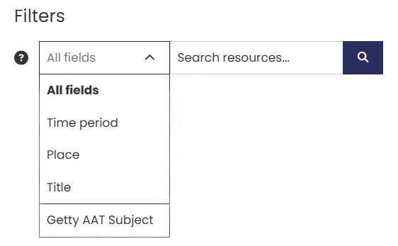
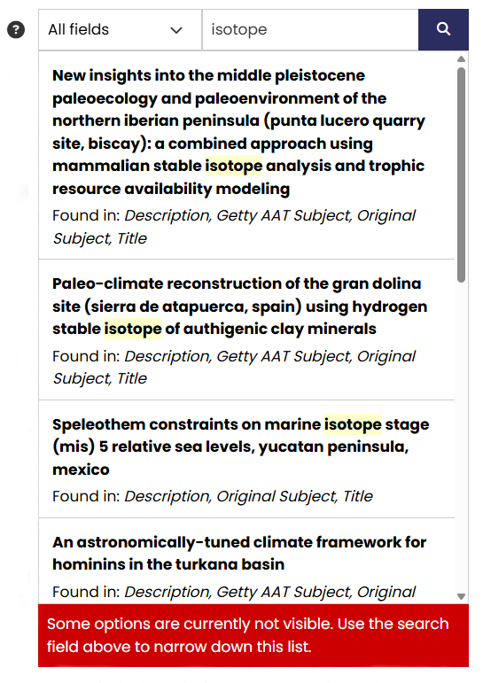

# What - The Text Tool

The What tool allows you to search for specific keywords and terms across selected metadata fields. You can choose from five different search filters to focus your search on different aspects related to heritage science.

| What | Description |
| ------------- | ----------- |
| &nbsp;&nbsp;&nbsp;&nbsp;&nbsp;&nbsp;&nbsp;&nbsp;&nbsp;&nbsp;&nbsp;&nbsp;&nbsp;&nbsp;&nbsp;&nbsp;&nbsp;&nbsp;&nbsp;&nbsp;&nbsp;&nbsp;&nbsp;&nbsp;&nbsp;&nbsp;&nbsp;&nbsp;&nbsp;&nbsp;&nbsp;&nbsp;&nbsp;&nbsp;&nbsp;&nbsp;&nbsp;&nbsp;&nbsp;&nbsp;&nbsp;&nbsp;&nbsp;&nbsp;&nbsp;&nbsp;&nbsp;&nbsp;&nbsp;&nbsp;&nbsp;&nbsp;&nbsp;&nbsp;&nbsp;&nbsp;&nbsp;&nbsp;&nbsp;&nbsp;&nbsp;&nbsp;&nbsp;&nbsp;&nbsp;&nbsp;&nbsp;&nbsp;&nbsp;&nbsp;&nbsp;&nbsp;&nbsp;&nbsp;&nbsp;  | The search text entry box is located in the top left corner of the page. Five filters are available based on the metadata supplied for each resource:   **All fields** – searches the entire record for matching terms.  **Time period** – searches for time period(s) names.  **Place** – searches for place names, from specific locations to continents.  **Title** – searches only within the title fields for matching terms.  **Getty AAT Subject** – searches subject(s) defined by the data provider that are matched to the Getty Arts and Architecture Thesaurus, enabling you to find data with matching translations and related terms. |

Enter one or more keywords in the text search box. When you use multiple words, the search will only find results that include every word you've entered. This is referred to as "AND" logic in search terminology. For example, a search for climate change” will return only records where both these words are found in the metadata, either next to one another or separately. 

When you enter a search term, a list of up to 10 matching records are displayed based on where the term appears in the metadata. Records with the highest number of matches are shown first. 

<figure markdown="span">
  { width="450" }
  <figcaption>Search results from text entry box</figcaption>
</figure>

## Fields

For the **Time Period, Place** and **Title** filters, only exact matches in the original language are returned. For example, if you select **Title** and search for the term 'Historic Building', the catalogue will return all records containing the text “Historic Building” in the Title field.

The **Getty AAT Subject** is a hierarchical search, which means any broad term such as “houses” will also include all results from sub-categories, such as Hall houses, Farmhouses, and Manor houses. The filter also enables a multilingual search by returning all records that contain a match in their native language as well as matching terms in other languages. 

[**Find out more about the Getty Arts and Architecture Thesaurus**](https://www.getty.edu/research/tools/vocabularies/aat/about.html)