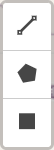

# Where - The Map tool

The Where tool uses an interactive map to display resource locations and allows you to refine your search results geographically. You can view results as heat spots, zoom into specific areas, or use drawing tools to define precise search boundaries.

| Where | Description |
| ----------- | ----------- |
| &nbsp;&nbsp;&nbsp;&nbsp;&nbsp;&nbsp;&nbsp;&nbsp;&nbsp;&nbsp;&nbsp;&nbsp;&nbsp;&nbsp;&nbsp;&nbsp;&nbsp;&nbsp;&nbsp;&nbsp;&nbsp;&nbsp;&nbsp;&nbsp;&nbsp;&nbsp;&nbsp;&nbsp;&nbsp;&nbsp;&nbsp;&nbsp;&nbsp;&nbsp;&nbsp;&nbsp;&nbsp;&nbsp;&nbsp;&nbsp;&nbsp;&nbsp;&nbsp;&nbsp;&nbsp;&nbsp;&nbsp;&nbsp;&nbsp;&nbsp;&nbsp;&nbsp;&nbsp;&nbsp;&nbsp;&nbsp;&nbsp;&nbsp;&nbsp;&nbsp;&nbsp;&nbsp;&nbsp;&nbsp;&nbsp;&nbsp;&nbsp;&nbsp;&nbsp;&nbsp;&nbsp;&nbsp;&nbsp;&nbsp;&nbsp;&nbsp;&nbsp;&nbsp;&nbsp;&nbsp;&nbsp;&nbsp;&nbsp;&nbsp;&nbsp;&nbsp;&nbsp;&nbsp;&nbsp;&nbsp; | The map on the Search results page displays the location of resources from your search results (where co-ordinates have been provided in the metadata). These appear as ‘heat spots’ on the map interface.   You can zoom in and out to a limited extent and change the map layers using the icons provided. See "Map filter options" below for more information.  By default, zooming in and out options will not change the defined area or the search results. |
|  | Use the map search feature to narrow down your results by location.   When you zoom in on the map, a "Search area" button will appear at the top. Click this button to update the search results list to show only the resources visible in your current map view.  As you zoom in closer, or when there are 500 resources or less, the heat map changes to show clusters and pins for more precise resource locations. Note that simply moving or expanding the map view won't change your results — you'll need to click "Search area" again to refresh them.   For more complex search areas and greater geographical precision, use the “Advanced search” option. |

## Advanced search

Clicking on ‘Advanced Search’ will open the Map filter page, where you can refine your search results geographically by navigating the map.

<i>Map filter page with full set of filters (left) geographical tools (right)</i>

The map can also be used alongside other search filters displayed on the left side of the screen. They can be hidden by clicking on the "Hide filter" button to the right of this column. 

The default base map uses Open Street Map (OSM), which shows national borders with place names in native languages. 

## Map filter options

A series of icons in the bottom right hand corner of the map provide options for filtering results using the map tool.

| Icon | Description |
| ----------- | ----------- |
|  | The Layers icon opens a sub-menu with six different base map display options, including Google Satellite and street map. All place names appear in English. |
|  | The Zoom icons allows you to zoom in and out of geographic regions. You can also zoom using a touchpad or mouse wheel where enabled.|
|  | The Drawing tools include:   **Line tool** - displays the distance between each point drawn. 
**Polygon tool** - defines a multi-sided area on the map. 
 **Rectangle tool** - defines a rectangular area on the map between two opposite corners. 
Results are updated to display records only located within the defined areas. Each of the drawing tools has options to complete, edit or cancel the operation. |

### Display as search result
Once you have defined an area of interest, you can view all related resources on the Results page by clicking the ‘Display as search result’ button in the top left corner of the screen. The number of resources within the curent view is shown above the button.

<i>Map shown in Google Satellite mode showing both individual and clusters of resources</i>

## Representation of resources on the map
### Pin icons

Different icons represent how resources appear on the map tool.

<figure markdown="span">
  
  <figcaption>Pin icons represent individual resources on the Map</figcaption>
</figure>
  
- **Geo point** - shows a single resource with exact co-ordinates. When multiple Geo points appear on the Map, the current resource is highlighted by an inner red ring. 
- **Geo shape** - indicates where a resource location is not precise. This occurs when the resource location is given as a geographical area (e.g. a town or region) or, where reports cover a large or multiple locations.
- **Approximate location icons** - shown when a resource location is considered sensitive, such as shipwrecks or sites where valuable metal artefacts have been found. Blue pins indicate an approximate point and red pins show an area. Individual record for red pin sites display a defined area (often rectangular) where the actual location is a random point within the shown area.

| Icons | Description |
| ----------- | ----------- |
|  | In this example, the red outline defines the area where a gold finger ring was found and includes two other resources each with nearby, imprecise locations. Additional resources with both exact and imprecise locations are visible within the larger area. |

### Cluster icons

<figure markdown="span">
  
  <figcaption>Cluster icons used to represent groups of resources on the Map</figcaption>
</figure>

Clusters icons denote locations where multiple resources can be found. The different colours indicate the total number of resources: blue = 1-10, yellow = 11-99 and red 100+ resources.

 

Hovering your mouse over individual Geo points and Geo shapes will display the title of the associated resource. In the example above, the circular pattern of Geo shapes represents a cluster of resources that have been assigned the same approximate location. This pattern appears when you click the cluster icon - each individual pin can then be clicked to view the related resource. 

Please note that the Map functions operate the same way on both the Advanced Search map tool and the main Results page. Individual Resource pages may show minor differences, such as imprecise or approximate locations.