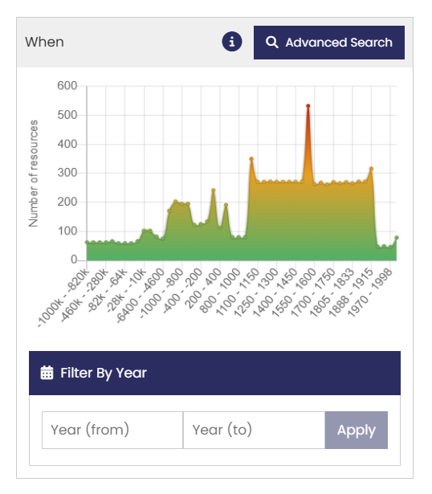
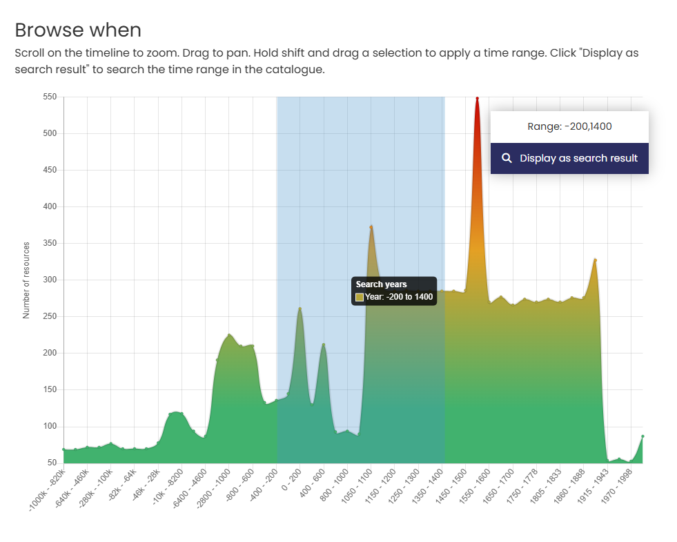
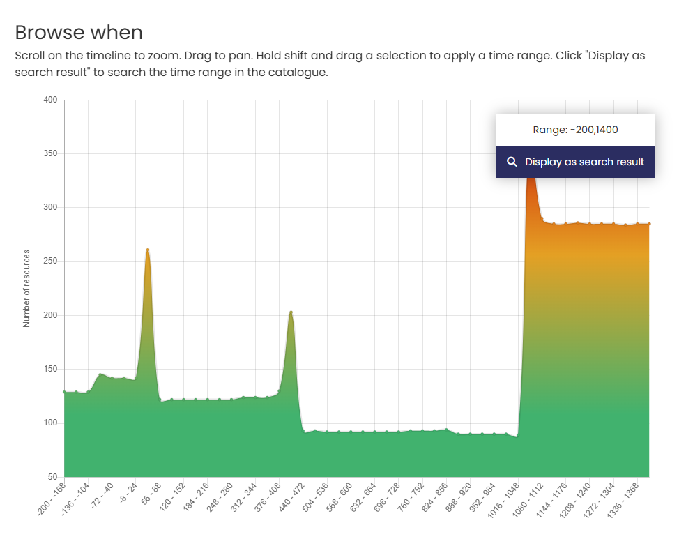
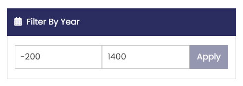
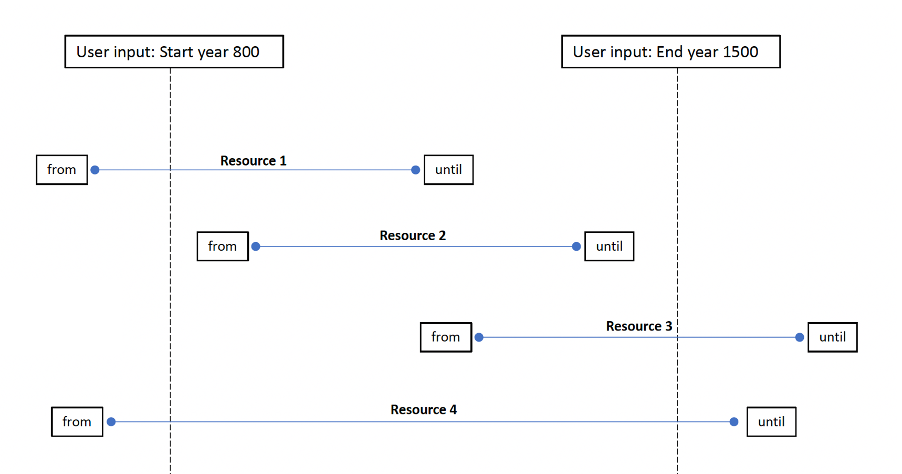

# When - The Time period tool

The When tool consists of two different ways of selecting a time period of interest: a graphic where you can use the mouse to select the date range and a text entry box where you can specify start and end years.

## The Time line

| The Time line | Description |
| ----------- | ----------- |
| &nbsp;&nbsp;&nbsp;&nbsp;&nbsp;&nbsp;&nbsp;&nbsp;&nbsp;&nbsp;&nbsp;&nbsp;&nbsp;&nbsp;&nbsp;&nbsp;&nbsp;&nbsp;&nbsp;&nbsp;&nbsp;&nbsp;&nbsp;&nbsp;&nbsp;&nbsp;&nbsp;&nbsp;&nbsp;&nbsp;&nbsp;&nbsp;&nbsp;&nbsp;&nbsp;&nbsp;&nbsp;&nbsp;&nbsp;&nbsp;&nbsp;&nbsp;&nbsp;&nbsp;&nbsp;&nbsp;&nbsp;&nbsp;&nbsp;&nbsp;&nbsp;&nbsp;&nbsp;&nbsp;&nbsp;&nbsp;&nbsp;&nbsp;&nbsp;&nbsp;&nbsp;&nbsp;&nbsp;&nbsp;&nbsp;&nbsp;&nbsp;&nbsp;&nbsp;&nbsp;&nbsp;&nbsp;&nbsp;&nbsp;&nbsp;&nbsp;&nbsp;&nbsp;&nbsp;&nbsp; | The Time line graphic displays the number of resources returned in your search results by date distribution.

You can refine the search results by clicking ‘Advanced Search’ to display the Time period filter page (see below). 
If no search term is used then the graph shows the date distribution for the entire catalogue. |
|  | On the 'Browse when' page, you can define a shorter time period by using the mouse and the Shift key directly on the display - in this case -200-1400 C.E.

Scrolling with your mouse will cause the time period graphic to expand. 
If you place the mouse closer to the left side, the x-axis will reduce the end date (‘stretch’ from the left), placed to the right the start date increases (‘stretch’ from the right).|
|  | Whenever you alter the time line graphic, the range updates to show your selected time span, and the distribution of resources by date is recalculated.

Clicking ‘Display as search result’ returns to the Results page displaying the refined records. |

## Filter by Year 

An alternative method for selecting a time period is to enter the start and end years in the text box below the graph. For dates before 0, place a - symbol before the number.

<figure markdown="span">
  { width="450" }
  <figcaption>Filter By Year input</figcaption>
</figure>

Using either method (graph or direct year entry), all records that specify a time period falling within or overlapping your selected time period will be returned in the results – as shown in the illustration below.

