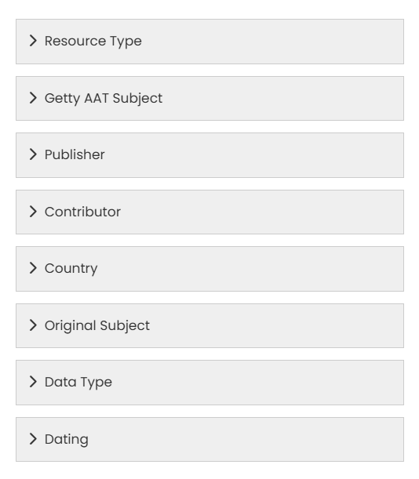
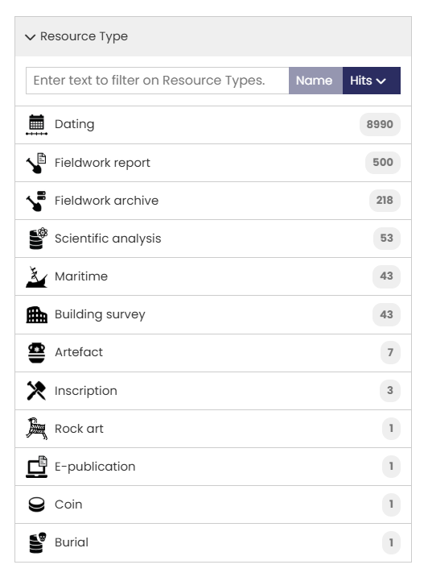
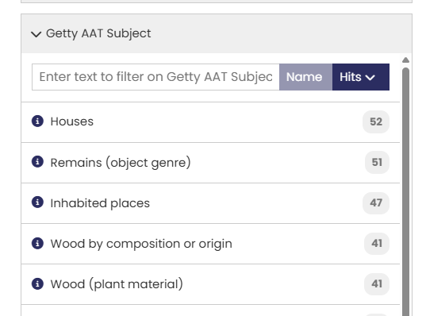
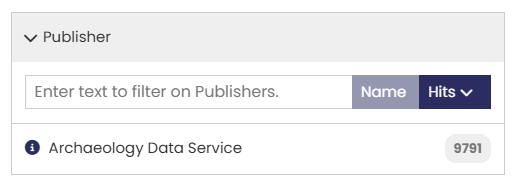
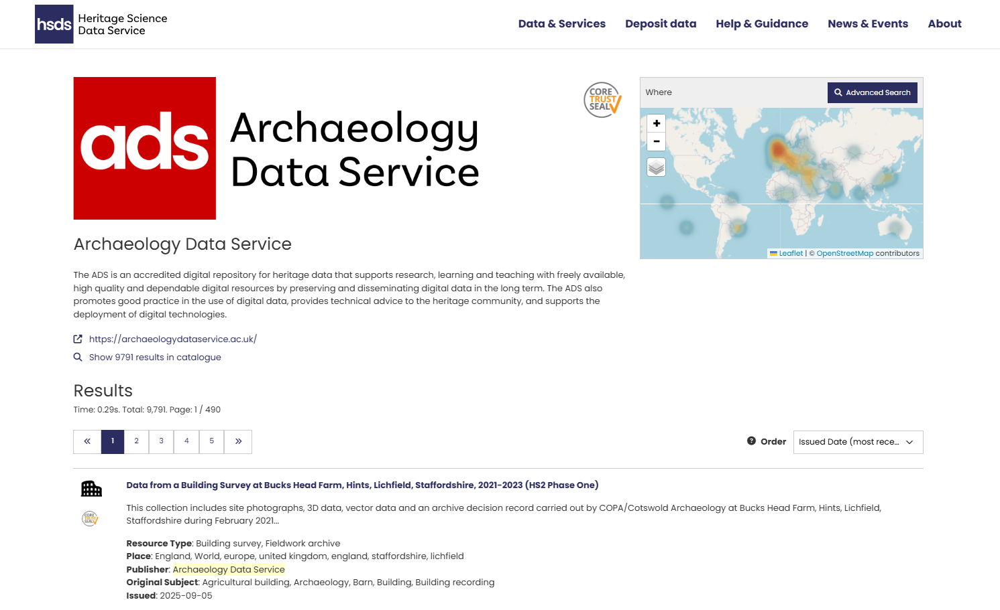
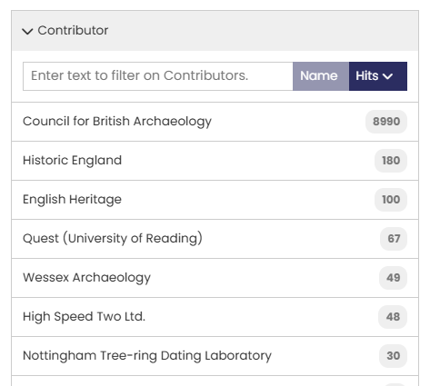
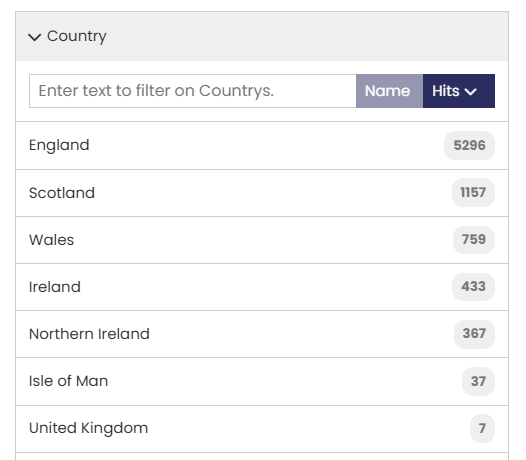
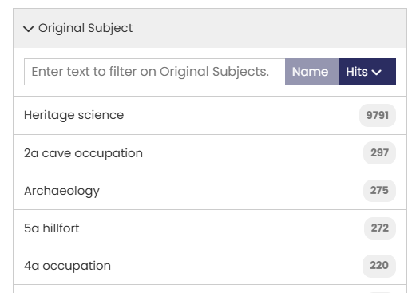
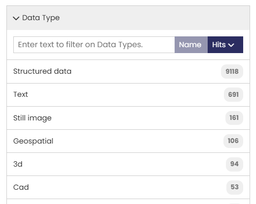
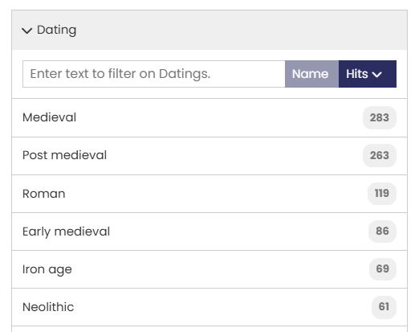

# Search Filters

In addition to the  [**What**](Section-1_What_HSDS.md), [**Where**](Section-2_Where_HSDS.md), and [**When**](Section-3_When_HSDS.md) tools, several filters operate on specific metadata fields to help you refine your search results. 

 

Below is a list of the avaiable search filter options, including the context for each filter and advice on how best to use them. 

## Resource Type

The Resource type is an concept developed by the [ARIADNE RI](https://www.ariadne-research-infrastructure.eu/) to categorise resources into general areas of research interest. Most Resource Type names are self-explanatory. 

| Resource Type | Description |
| ----------- | ----------- |
| &nbsp;&nbsp;&nbsp;&nbsp;&nbsp;&nbsp;&nbsp;&nbsp;&nbsp;&nbsp;&nbsp;&nbsp;&nbsp;&nbsp;&nbsp;&nbsp;&nbsp;&nbsp;&nbsp;&nbsp;&nbsp;&nbsp;&nbsp;&nbsp;&nbsp;&nbsp;&nbsp;&nbsp;&nbsp;&nbsp;&nbsp;&nbsp;&nbsp;&nbsp;&nbsp;&nbsp;&nbsp;&nbsp;&nbsp;&nbsp;&nbsp;&nbsp;&nbsp;&nbsp;&nbsp;&nbsp;&nbsp;&nbsp;&nbsp;&nbsp;&nbsp;&nbsp;&nbsp;&nbsp;&nbsp;&nbsp;&nbsp;&nbsp;&nbsp;&nbsp;&nbsp;&nbsp;&nbsp;&nbsp;&nbsp;&nbsp;&nbsp;&nbsp;&nbsp;&nbsp;&nbsp;&nbsp;&nbsp;&nbsp;&nbsp;&nbsp;&nbsp;&nbsp;&nbsp;&nbsp;&nbsp;&nbsp;&nbsp;&nbsp;&nbsp;&nbsp;&nbsp;&nbsp;&nbsp;&nbsp;&nbsp;&nbsp;&nbsp;&nbsp;&nbsp;&nbsp;&nbsp;&nbsp;&nbsp;&nbsp;&nbsp;&nbsp;&nbsp;&nbsp;&nbsp;&nbsp;&nbsp;&nbsp;&nbsp;&nbsp;&nbsp;&nbsp;&nbsp;&nbsp;&nbsp;&nbsp;&nbsp;&nbsp;&nbsp;&nbsp;&nbsp;  | Resource types that may need clarification are:  **Dating** – datasets used for dating materials such as radiocarbon and dendrology.  **Fieldwork** – typically a record relating to specific fieldwork such as evaluations or interventions.   **Fieldwork report** – report related to a fieldwork project that always include a link (URL or DOI) to the actual document.  **Fieldwork archive** –  a collection of documents, images and other materials relating to a site (accessible from the DOI) |

You can select more than one Resource type but note that the default operator on terms within a filter is ‘AND’, so this will only return results where all selected terms have been applied. For example, all “Maritime” resources are also classified as Resource type “Site/monument” so combining both Resource Types produces the same result as selecting just "Maritime” (this is logical since maritime records relate to shipwrecks). 

## Getty AAT Subjects

The [Getty Arts and Architecture Thesaurus (AAT)](https://www.getty.edu/research/tools/vocabularies/aat/about.html) has been used to classify each resource, mapping the original subject(s) to those found in this extensive ontology. Over one thousand terms have been used and each resource in the catalogue usually has more than one term assigned to it. 

!!! note "**Pro tip**"

    The use of this filter is highly recommended to obtain accurate, meaningful results.

<figure markdown="span">
  
  <figcaption>The Getty Arts & Architecture Thesaurus Subjects filter (five most commonly used terms)</figcaption>
</figure>

The Getty AAT is structured hierarchically, so when you specify a single higher level term in this filter, the search results will also include all relevant sub-categories. 

When multiple terms are used as a filter, logical ‘AND’ is applied so only resources matching all the terms will be returned in the search results. Hierarchical sub-categories are not used with multiple terms, only the exact term specified. 

When search results are displayed, the Getty AAT filter will only show the first 20 terms found within the current set of resources, ordered by number of search results. You can display more search terms by clicking the “Get 20 more results..” box at the end of the list. This button extends the list with a scroll bar and can be repeated until you have viewed all matching terms. 

## Publisher

| Publisher | Description |
| ----------- | ----------- |
| &nbsp;&nbsp;&nbsp;&nbsp;&nbsp;&nbsp;&nbsp;&nbsp;&nbsp;&nbsp;&nbsp;&nbsp;&nbsp;&nbsp;&nbsp;&nbsp;&nbsp;&nbsp;&nbsp;&nbsp;&nbsp;&nbsp;&nbsp;&nbsp;&nbsp;&nbsp;&nbsp;&nbsp;&nbsp;&nbsp;&nbsp;&nbsp;&nbsp;&nbsp;&nbsp;&nbsp;&nbsp;&nbsp;&nbsp;&nbsp;&nbsp;&nbsp;&nbsp;&nbsp;&nbsp;&nbsp;&nbsp;&nbsp;&nbsp;&nbsp;&nbsp;&nbsp;&nbsp;&nbsp;&nbsp;&nbsp;&nbsp;&nbsp;&nbsp;&nbsp;&nbsp;&nbsp;&nbsp;&nbsp;&nbsp;&nbsp;&nbsp;&nbsp;&nbsp;&nbsp;&nbsp;&nbsp;&nbsp;&nbsp;&nbsp;&nbsp;&nbsp;&nbsp; | The Publisher is the organisation that has supplied the metadata to the Data Catalogue and is responsible for the maintaining and updating this metadata. Currently the ADS is the only publisher included in the Data Catalogue.   The Publisher may also own the original data or be responsible for its maintenance, as is the case with regional and national repositories. |

The “i” icon next to each name provides a short summary about the Publisher on a new page. This page also shows the geographic distribution of that publisher's records on a map and displays the first 20 record, below a link to the Publisher’s website. The second link displays these results in the standard ‘Results’ page.

{ width="850" }

<i>The Publisher information for the ADS</i>

## Contributor

| Contributor | Description |
| ----------- | ----------- |
| &nbsp;&nbsp;&nbsp;&nbsp;&nbsp;&nbsp;&nbsp;&nbsp;&nbsp;&nbsp;&nbsp;&nbsp;&nbsp;&nbsp;&nbsp;&nbsp;&nbsp;&nbsp;&nbsp;&nbsp;&nbsp;&nbsp;&nbsp;&nbsp;&nbsp;&nbsp;&nbsp;&nbsp;&nbsp;&nbsp;&nbsp;&nbsp;&nbsp;&nbsp;&nbsp;&nbsp;&nbsp;&nbsp;&nbsp;&nbsp;&nbsp;&nbsp;&nbsp;&nbsp;&nbsp;&nbsp;&nbsp;&nbsp;&nbsp;&nbsp;&nbsp;&nbsp;&nbsp;&nbsp;&nbsp;&nbsp;&nbsp;&nbsp;&nbsp;&nbsp;&nbsp;&nbsp;&nbsp;&nbsp;&nbsp;&nbsp;&nbsp;&nbsp;&nbsp;&nbsp;&nbsp;&nbsp;&nbsp;&nbsp;&nbsp;&nbsp;&nbsp;&nbsp;&nbsp;&nbsp;&nbsp; | The Contributor is typically (but not always) the original owner of the data. The Publisher creates and maps the metadata in the Catalogue on behalf of the Contributor.

## Country

| Country | Description |
| ----------- | ----------- |
| &nbsp;&nbsp;&nbsp;&nbsp;&nbsp;&nbsp;&nbsp;&nbsp;&nbsp;&nbsp;&nbsp;&nbsp;&nbsp;&nbsp;&nbsp;&nbsp;&nbsp;&nbsp;&nbsp;&nbsp;&nbsp;&nbsp;&nbsp;&nbsp;&nbsp;&nbsp;&nbsp;&nbsp;&nbsp;&nbsp;&nbsp;&nbsp;&nbsp;&nbsp;&nbsp;&nbsp;&nbsp;&nbsp;&nbsp;&nbsp;&nbsp;&nbsp;&nbsp;&nbsp;&nbsp;&nbsp;&nbsp;&nbsp;&nbsp;&nbsp;&nbsp;&nbsp;&nbsp;&nbsp;&nbsp;&nbsp;&nbsp;&nbsp;&nbsp;&nbsp;&nbsp;&nbsp;&nbsp;&nbsp;&nbsp;&nbsp;&nbsp;&nbsp;&nbsp;&nbsp;&nbsp;&nbsp;&nbsp;&nbsp;&nbsp;&nbsp;&nbsp;&nbsp;  | Country is the modern geographical region(s) that relates to each resource.   The Map tool can be used to define smaller areas or regions that cross multiple countries where modern boundaries do not apply. |

## Original Subject

| Original Subject| Description |
| ----------- | ----------- |
| &nbsp;&nbsp;&nbsp;&nbsp;&nbsp;&nbsp;&nbsp;&nbsp;&nbsp;&nbsp;&nbsp;&nbsp;&nbsp;&nbsp;&nbsp;&nbsp;&nbsp;&nbsp;&nbsp;&nbsp;&nbsp;&nbsp;&nbsp;&nbsp;&nbsp;&nbsp;&nbsp;&nbsp;&nbsp;&nbsp;&nbsp;&nbsp;&nbsp;&nbsp;&nbsp;&nbsp;&nbsp;&nbsp;&nbsp;&nbsp;&nbsp;&nbsp;&nbsp;&nbsp;&nbsp;&nbsp;&nbsp;&nbsp;&nbsp;&nbsp;&nbsp;&nbsp;&nbsp;&nbsp;&nbsp;&nbsp;&nbsp;&nbsp;&nbsp;&nbsp;&nbsp;&nbsp;&nbsp;&nbsp;&nbsp;&nbsp;&nbsp;&nbsp;&nbsp;&nbsp;&nbsp;&nbsp;&nbsp;&nbsp;&nbsp;&nbsp;&nbsp;&nbsp;&nbsp;&nbsp;&nbsp;&nbsp;&nbsp;&nbsp;&nbsp;&nbsp;&nbsp;&nbsp;&nbsp;&nbsp;&nbsp;&nbsp;&nbsp;&nbsp;&nbsp;&nbsp;&nbsp;| The original subject is the term from the ontology used by the Contributor and/or Publisher, which has been mapped to the Getty AAT.  The Original subject will, in most cases, be in the native language of the provider. The option to filter using these localised terms facilitates both multi-lingual searches and terminology specific to a single Publisher. |

## Data Type
| Data Type | Description |
| ----------- | ----------- |
|&nbsp;&nbsp;&nbsp;&nbsp;&nbsp;&nbsp;&nbsp;&nbsp;&nbsp;&nbsp;&nbsp;&nbsp;&nbsp;&nbsp;&nbsp;&nbsp;&nbsp;&nbsp;&nbsp;&nbsp;&nbsp;&nbsp;&nbsp;&nbsp;&nbsp;&nbsp;&nbsp;&nbsp;&nbsp;&nbsp;&nbsp;&nbsp;&nbsp;&nbsp;&nbsp;&nbsp;&nbsp;&nbsp;&nbsp;&nbsp;&nbsp;&nbsp;&nbsp;&nbsp;&nbsp;&nbsp;&nbsp;&nbsp;&nbsp;&nbsp;&nbsp;&nbsp;&nbsp;&nbsp;&nbsp;&nbsp;&nbsp;&nbsp;&nbsp;&nbsp;&nbsp;&nbsp;&nbsp;&nbsp;&nbsp;&nbsp;&nbsp;&nbsp;&nbsp;&nbsp;&nbsp;&nbsp;&nbsp;&nbsp;&nbsp;&nbsp;&nbsp;&nbsp;&nbsp;&nbsp;&nbsp;&nbsp;&nbsp;&nbsp;&nbsp;&nbsp;&nbsp;&nbsp;&nbsp;  | The Data Type refers to the structure of the resource. Most resources are digital in format although some metadata in the Catalogue refers to physical publications. |

## Dating

The dating filter works solely on the information in the ‘Dating’ field of the metadata. This is a broad category that includes named periods as well as date numerals, general terms such as ‘16th century’, and localised terms that are specific to regions. The Dating filter is intended to cover all resources, some of which may not have both start and end dates or are defined in [PeriodO](https://perio.do/en/). 

| Dating | Description |
| ----------- | ----------- |
| &nbsp;&nbsp;&nbsp;&nbsp;&nbsp;&nbsp;&nbsp;&nbsp;&nbsp;&nbsp;&nbsp;&nbsp;&nbsp;&nbsp;&nbsp;&nbsp;&nbsp;&nbsp;&nbsp;&nbsp;&nbsp;&nbsp;&nbsp;&nbsp;&nbsp;&nbsp;&nbsp;&nbsp;&nbsp;&nbsp;&nbsp;&nbsp;&nbsp;&nbsp;&nbsp;&nbsp;&nbsp;&nbsp;&nbsp;&nbsp;&nbsp;&nbsp;&nbsp;&nbsp;&nbsp;&nbsp;&nbsp;&nbsp;&nbsp;&nbsp;&nbsp;&nbsp;&nbsp;&nbsp;&nbsp;&nbsp;&nbsp;&nbsp;&nbsp;&nbsp;&nbsp;&nbsp;&nbsp;&nbsp;&nbsp;&nbsp;&nbsp;&nbsp;&nbsp;&nbsp;&nbsp;&nbsp;&nbsp;&nbsp;&nbsp;&nbsp;&nbsp;&nbsp;&nbsp;&nbsp;&nbsp;&nbsp;&nbsp;&nbsp;&nbsp;&nbsp;&nbsp;&nbsp;&nbsp;&nbsp;&nbsp;&nbsp;&nbsp;&nbsp;&nbsp; | In this example, all matches to the first four characters “medi” entered in the text box are listed.   Several matches to the intended term “medieval” are shown, as well as others where different spellings or languages have been used in the original metadata.   |

## Filter options on the results page

When you apply one or more filters to the search, the results are automatically updated and the current selection is displayed at the top of the results page. To remove a filter, click the red 'x' on each term and the results list will be updated automatically.

## Using Search filters with other parameters

The search results will automatically populate filters with all matching terms from the records found. For some filters (Resource Type, Publisher,  Country), the number of term matches will match the number of records. However, for others (Getty AAT subject, Original subject, Dating), the number of matching terms will exceed the total number of records, as these searches include all other terms found in these fields. 

Using the ‘Clear All Filters’ option, located just below the text entry box, will clear all search filters you have applied and revert the search results to the entire Catalogue.