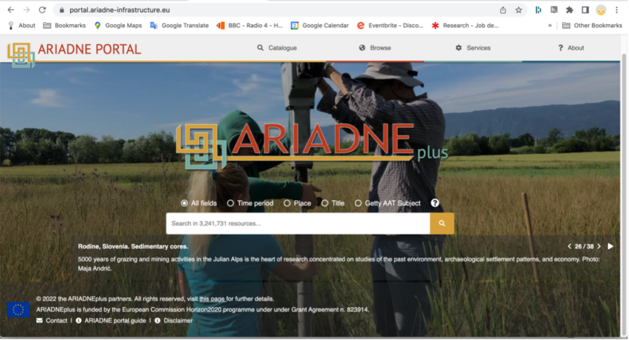

# Using the ARIADNE Catalogue

The ARIADNE Portal contains a Catalogue and several services which provide access to over 4 million archaeological resources that can be searched and filtered according to a number of criteria. The returned results from the search facilities provided with the Catalogue are listed individually as well as aggregated results on the map and on the timeline. This Guide aims at helping all end users to get the maximum benefit from using the Catalogue.

A separate section of the Portal provides several services and tools to assist archaeologists with their research, from planning data management, exploration and analysis to display of all types of data (including from the ARIADNE Knowledgebase, where applicable). Each of these services has its own information on their use and application, so are not covered by this Guide.

For further information about the ARIADNE Research Infrastructure and the Portal, see the ? About page.

## Overview

Provide a high-level overview of the topic. This section should give readers a quick understanding of what they'll learn.

## Key Points

- Important point 1
- Important point 2
- Important point 3

## Detailed Information

More in-depth content goes here. You can organize this section with additional subheadings as needed.

### Subsection 1

Content for subsection 1.

### Subsection 2

Content for subsection 2.

## Examples

